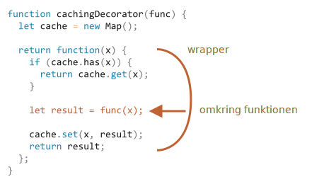

# Decorators og videresendelse, call/apply

JavaScript giver enestående fleksibilitet, når det kommer til funktioner. De kan sendes rundt, bruges som objekter, og nu vil vi se, hvordan man *videresender* kald mellem dem og *dekorerer* dem.

## Transparent caching

Lad os sige, at vi har en funktion `slow(x)`, som er CPU-tung, men dens resultater er stabile. Med andre ord returnerer den altid det samme resultat for den samme `x`.

Hvis funktionen kaldes ofte, kan vi ønske at cache (huske) resultaterne for at undgå at bruge ekstra tid på genberegninger.

Men i stedet for at tilføje den funktionalitet direkte i `slow()`, vil vi oprette en wrapper-funktion, der tilføjer caching. Som vi vil se, er der mange fordele ved at gøre det.

Her er koden. Forklaringen følger nedenfor:

```js run
function slow(x) {
  // her kan der være et CPU-tungt job
  alert(`Kaldt med ${x}`);
  return x;
}

function cachingDecorator(func) {
  let cache = new Map();

  return function(x) {
    if (cache.has(x)) {    // hvis der er sådan en nøgle i cache
      return cache.get(x); // læs resultatet fra cache
    }

    let result = func(x);  // ellers kald func

    cache.set(x, result);  // og "cache" (husk) resultatet
    return result;
  };
}

slow = cachingDecorator(slow);

alert( slow(1) ); // slow(1) er gemt i cache og resultatet returneres
alert( "Again: " + slow(1) ); // slow(1) resultatet returnes fra cache

alert( slow(2) ); // slow(2) er gemt i cache og resultatet returneres
alert( "Again: " + slow(2) ); // slow(2) resultatet returnes fra cache
```

I koden ovenfor er `cachingDecorator` en *decorator*: en speciel funktion, der tager en anden funktion og ændrer dens adfærd.

Ideen er at vi kalder `cachingDecorator` for en hvilken som helst funktion, og den returnerer en caching-wrapper. Det er godt, fordi vi kan have mange funktioner, der kunne bruge denne funktionalitet, og alt hvad vi behøver at gøre er at anvende `cachingDecorator` på dem.

Ved at separere caching fra hovedfunktionens kode holder vi også hovedkoden enkel.

Resultatet af `cachingDecorator(func)` er en "wrapper": `function(x)` som "wrapper" (omkranser) kaldet af `func(x)` i caching-logik:


Set udefra vil den nye "wrapped" funktion opføre sig som den originale funktion, men med tilføjet caching-funktionalitet.

Kort sagt, der er flere fordele ved at bruge en separat `cachingDecorator` i stedet for at ændre koden i `slow` selv:

- `cachingDecorator` er genbrugelig. Vi kan anvende den på en anden funktion.
- Caching-logikken er separat, den øgede ikke kompleksiteten i `slow` selv (hvis der var nogen).
- Vi kan kombinere flere decorators hvis det er nødvendigt (andre decorators vil følge).

## Brug "func.call" for at få kontekst

Caching decoratoren nævnt ovenfor er ikke egnet til at arbejde med objektmetoder.

For eksempel, i koden nedenfor stopper `worker.slow()` efter dekoration med en fejl:

```js run
// Vi laver worker.slow om til en udgave med caching
let worker = {
  someMethod() {
    return 1;
  },

  slow(x) {
    // CPU-tung opgave her  
    alert("Kaldt med " + x);
    return x * this.someMethod(); // (*)
  }
};

// samme kode som før
function cachingDecorator(func) {
  let cache = new Map();
  return function(x) {
    if (cache.has(x)) {
      return cache.get(x);
    }
*!*
    let result = func(x); // (**)
*/!*
    cache.set(x, result);
    return result;
  };
}

alert( worker.slow(1) ); // den oprindelige metode virker

worker.slow = cachingDecorator(worker.slow); // lad os lave den om til en udgave med cache

*!*
alert( worker.slow(2) ); // Ups! Error: Cannot read property 'someMethod' of undefined
*/!*
```

Fejlen sker i linjen med `(*)` der prøver at tilgå `this.someMethod` men fejler. Kan du se hvorfor?

Grunden til det er at wrapperen kalder den originale funktion som `func(x)` i linjen `(**)`. Og, når den bliver kaldt på den måde, får funktionen `this = undefined`.

Vi vil se det samme ske hvis vi prøvede at køre:

```js
let func = worker.slow;
func(2);
```

Så wrapperen videregiver kaldet til den originale metode, men uden konteksten `this`. Derfor fejler det.

Lad os fikse det.

Der er en indbygget funktion kaldet [func.call(context, ...args)](mdn:js/Function/call) der er skabt specielt til lejligheden. Den tillader at kalde en funktion eksplicit og sætte `this`.

Syntaksen er:

```js
func.call(context, arg1, arg2, ...)
```

Den kører `func` og giver det en henvisning til `this` med som første argument, og derefter eventuelt de næste argumenter.

Sat lidt simpelt op gør disse to kald næsten det samme:
```js
func(1, 2, 3);
func.call(obj, 1, 2, 3)
```

De kalder begge `func` med argumenterne `1`, `2` and `3`. Den eneste forskel er at `func.call` også sætter `this` til `obj`.

I koden nedenfor kalder vi `sayHi` med forskellige objekter som kontekst: `sayHi.call(user)` kører `sayHi` men leverer `this=user` som kontekst mens den næste linje sætter `this=admin`:

```js run
function sayHi() {
  alert(this.name);
}

let user = { name: "John" };
let admin = { name: "Admin" };

// brug call for at videregive forskellige objekter som "this"
sayHi.call( user ); // John
sayHi.call( admin ); // Admin
```

og her bruger vi `call` til at kalde `say` med den givne kontekst og frase:


```js run
function say(phrase) {
  alert(this.name + ': ' + phrase);
}

let user = { name: "John" };

// user bliver til this og "Hej" bliver det første argument
say.call( user, "Hej" ); // John: Hej
```

I vores oprindelige eksempel kan vi bruge `call` i wrapperen til at videregive konteksten til den originale funktion:

```js run
let worker = {
  someMethod() {
    return 1;
  },

  slow(x) {
    alert("Kaldt med " + x);
    return x * this.someMethod(); // (*)
  }
};

function cachingDecorator(func) {
  let cache = new Map();
  return function(x) {
    if (cache.has(x)) {
      return cache.get(x);
    }
*!*
    let result = func.call(this, x); // "this" liver sendt rigtigt nu
*/!*
    cache.set(x, result);
    return result;
  };
}

worker.slow = cachingDecorator(worker.slow); // omdan den til en version med cache

alert( worker.slow(2) ); // virker
alert( worker.slow(2) ); // virker, kalder ikke originalen med den cachede version
```

Nu virker alt fint.

For at gøre det helt tydeligt, lad os gå mere i dybden med hvordan `this` videregives i det sidste eksempel:

1. Efter dekorationen af `worker.slow` er den nu omdannet til wrapperen `function (x) { ... }`.
2. Så når `worker.slow(2)` eksekveres vil wrapperen få `2` som argument og `this=worker` (det er objektet før punktum).
3. Inde i wrapperen, forudsat at det ikke er i chachen, vil `func.call(this, x)` videregive den aktuelle `this` (`=worker`) og det aktuelle argument (`=2`) til den originale metode.

## Hvad med flere argumenter?

Lad os gøre `cachingDecorator` endnu mere universiel. Indtil videre fungerer den kun med funktioner med ét argument.

Hvordan skal vi cache en multi-argument `worker.slow` metode?

```js
let worker = {
  slow(min, max) {
    return min + max; // Skræmmende tung CPU-opgave her
  }
};

// skal huske kald med de samme argumenter
worker.slow = cachingDecorator(worker.slow);
```

Tidligere kunne vi for et enkelt argument `x` bare kalde `cache.set(x, result)` for at gemme resultatet og `cache.get(x)` for at hente det. Men nu skal vi huske resultatet for en *kombination af argumenter* `(min,max)`. Den indbyggede `Map` tager kun en enkelt værdi som nøgle.

Der er flere mulige løsninger:

1. Implementer en ny (eller brug en 3de-parts) map-lignende datastruktur der er mere fleksibel og tillader brug af flere nøgler.
2. Brug indlejrede maps: `cache.set(min)` vil bleve et `Map` der gemmer parret `(max, result)`. På den måde kan vi hente `resultatet` som `cache.get(min).get(max)`.
3. Forbind to værdier til et. I vores tilfælde vil vi kunne bruge en simpel streng `"min,max"` som `Map`-nøgle. For fleksibilitet kan vi levere en *hashing funktion* til vores decorator, der ved hvordan man laver en værdi ud af mange.

For de fleste praktiske anvendelser er variant 3 god nok, så vi holder os til den.

Endelig skal vi huske at vi ikke bare skal sende `x`, men alle argumenter i `func.call`. Lad os huske at i en `function()` kan vi få et pseudo-array af dens argumenter som `arguments`, så `func.call(this, x)` bør erstattes med `func.call(this, ...arguments)`.

Her er en mere kraftfuld `cachingDecorator`:

```js run
let worker = {
  slow(min, max) {
    alert(`Called with ${min},${max}`);
    return min + max;
  }
};

function cachingDecorator(func, hash) {
  let cache = new Map();
  return function() {
*!*
    let key = hash(arguments); // (*)
*/!*
    if (cache.has(key)) {
      return cache.get(key);
    }

*!*
    let result = func.call(this, ...arguments); // (**)
*/!*

    cache.set(key, result);
    return result;
  };
}

function hash(args) {
  return args[0] + ',' + args[1];
}

worker.slow = cachingDecorator(worker.slow, hash);

alert( worker.slow(3, 5) ); // virker, slow(3, 5) er gemt i cache
alert( "Igen " + worker.slow(3, 5) ); // det samme her (cachet resultat returneres)
```

Nu virker det med et givet antal argumenter (selvom hashing-funktionen også skal justeres for at tillade et vilkårligt antal argumenter. En interessant måde at håndtere dette vil blive beskrevet nedenfor).

Der er to ændringer i `cachingDecorator`:

- I linjen `(*)` kaldes funktionen `hash` som opretter en enkelt tekststreng som nøgle fra `arguments`. Det er en simpel "join" funktion der omdanner argumenterne `(3, 5)` til strengen `"3,5"`. Mere komplekse tilfælde kan kræve andre hashing-funktioner.
- Senere i `(**)` bruger `func.call(this, ...arguments)` til at videregive både context og alle argumenter som wrapperen fik (ikke kun det første) til den originale funktion.

## func.apply

I stedet for `func.call(this, ...arguments)` kunne vi bruge `func.apply(this, arguments)`.

Syntaksen for den indbyggede metode [func.apply](mdn:js/Function/apply) er:

```js
func.apply(context, args)
```

Den kører `func` og sætter `this=context` og bruger et array-lignende objekt `args` som en liste af argumenter.

Den eneste forskel på syntaksen mellem `call` og `apply` er at `call` forventer en liste af argumenter, mens `apply` tager et array-lignende objekt med dem.

Så disse to kald er næsten ens:

```js
func.call(context, ...args);
func.apply(context, args);
```

De udfører det samme kald af `func` med en givet kontekst og argumenter.

Der er kun en lille forskel i håndtering af `args`:

- Spread syntaksen `...` tillader at videregive *itererbare* `args` som en liste til `call`.
- `apply` tillader kun *array-lignende* `args`.

...og for objekter der både er itererbare og array-lignende, så som rigtige arrays, kan vi bruge begge. Men `apply` vil sikkert være hurtigere, fordi de fleste JavaScript-motorer internt optimerer det bedre.

Et videregive alle argumenter sammen med konteksten til en anden funktion kaldes *call forwarding*.

Dette er den simpleste form af det:

```js
let wrapper = function() {
  return func.apply(this, arguments);
};
```

Når en ekstern kode kalder en sådan `wrapper`, er det ikke muligt at skelne mellem kaldet af denne fra den originale funktion `func`.

## Lån en metode [#method-borrowing]

Lad os nu lave en mindre forbedring til hashing-funktionen.

```js
function hash(args) {
  return args[0] + ',' + args[1];
}
```

Som det er nu virker det kun på to argumenter. Det ville være bedre hvis den kunne sammenkæde et vilkårligt antal `args`.

Den naturlige løsning vil være at bruge metoden [arr.join](mdn:js/Array/join):

```js
function hash(args) {
  return args.join();
}
```

...uheldigvis virker det ikke. Det er fordi vi kalder `hash(arguments)` og `arguments` objektet er både itererbart og array-lignende  - men ikke et *rigtigt* array.

Så kaldet til `join` på det vil fejle, som vi ser nedenfor:

```js run
function hash() {
*!*
  alert( arguments.join() ); // Error: arguments.join is not a function
*/!*
}

hash(1, 2);
```

Men, der er et nemt trick til at kunne bruge array join:

```js run
function hash() {
*!*
  alert( [].join.call(arguments) ); // 1,2
*/!*
}

hash(1, 2);
```

Dette trick kaldes*method borrowing*.

Vi tager (låner) join metoden fra et regulært array (`[].join`) og bruger `[].join.call` til at køre det i kontekst af `arguments`.

Hvorfor virker det?

Det er fordi den interne algoritme for metoden `arr.join(glue)` er ret simpel.

Taget fra specifikationen som det står ordret:

1. Lad `glue` være det første argument eller, hvis ingen argumenter, så en komma `","`.
2. Lad `result` være en tom streng.
3. Tilføj `this[0]` til `result`.
4. Tilføj `glue` og `this[1]`.
5. Tilføj `glue` og `this[2]`.
6. ...fortsæt indtil `this.length` elementer er sammenkædet.
7. Returner `result`.

Så teknisk set tager den `this` og kæder `this[0]`, `this[1]` ...osv sammen. Det er bevidst skrevet på en måde der tillader ethvert array-lignende `this` (ikke en tilfældighed, mange metoder følger denne praksis). Derfor virker det også med `this=arguments`.

## Decorators og egenskaber af funktioner

Det er normalt uproblematisk at erstatte en funktion eller en metode med en dekoreret version, bortset fra ét lille punkt. Hvis den originale funktion havde egenskaber på sig, som `func.calledCount` eller lignende, så vil den dekorerede funktion tage dem i betragtning. Set i det lys skal man være opmærksom på at kopiere egenskaberne fra den originale funktion til wrapperen, hvis de findes.

E.g. i eksemplet ovenfor, hvis `slow` funktionen havde nogle egenskaber på sig, så vil `cachingDecorator(slow)` være en wrapper uden dem.

Nogle dekoratorer kan give deres egne egenskaber. F.eks. kan en dekorator tælle hvor mange gange en funktion blev kaldt og hvor lang tid det tog, og eksponere denne information via wrapper-egenskaber.

Der findes måder at oprette dekoratorer der bevarede adgang til funktionsegenskaber, men det kræver brugen af et specielt `Proxy` objekt til at omkring en funktion. Vi vil diskutere det senere i artiklen <info:proxy#proxy-apply>.

## Opsummering

*Decorator* er en wrapper omkring en funktion, som ændrer dens adfærd. Det primære job er stadig udført af den originale funktion.

Decorators kan ses som "features" eller "aspekter" som kan tilføjes til en funktion. Vi kan tilføje én eller flere. Det særlige ved dekoratorer er at alt dette uden at ændre dens kode!

For at implementere `cachingDecorator`, studerede vi to metoder:
- [func.call(context, arg1, arg2...)](mdn:js/Function/call) -- kalder `func` med en given kontekst og argumenter.
- [func.apply(context, args)](mdn:js/Function/apply) -- kalder `func` med `context` som `this` og array-lignende `args` som en liste af argumenter.

Den generelle *call forwarding* sker normalt med `apply`:

```js
let wrapper = function() {
  return original.apply(this, arguments);
};
```

Vi så også et eksempel på *method borrowing* hvor vi tager en metode fra et objekt og kalder den med `call` i kontekst af et andet objekt. Det er ganske almindeligt at tage array-metoder og anvende dem på `arguments`. Den alternative tilgang er at bruge rest parameters objektet, som er et rigtigt array.

Der findes mange dekoratorer i kodeprojekter på nettet. Tjek hvor godt du fik styr på dem ved at løse opgaverne i dette kapitel.
