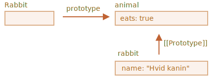

# F.prototype

Du husker nok at nye objekter kan oprettes med en konstruktør funktion, som f.eks. `new F()`.

Hvis `F.prototype` er et objekt, så bruger `new`-operatoren det til at sætte `[[Prototype]]` for det nye objekt.

```smart
JavaScript har haft nedarvning fra prototype fra begyndelsen. Det er en af sprogets kernetræk.


Men i gamle dage var der ikke nogen direkte adgang til det. Den eneste ting der virkede pålideligt var en `"prototype"` egenskab i konstruktør funktioner som vi beskriver i dette kapitel. Så der er mange scripts der stadig bruger denne tilgang.
```

Bemærk at udtrykket `F.prototype` her betyder en regulær egenskab kaldet `"prototype"` på objektet `F`. Det lyder som noget tæt på selve begrebet "prototype", men her mener vi faktisk bare en regulær egenskab med det navn.

Her er et eksempel:

```js run
let animal = {
  eats: true
};

function Rabbit(name) {
  this.name = name;
}

*!*
Rabbit.prototype = animal;
*/!*

let rabbit = new Rabbit("Hvid kanin"); //  rabbit.__proto__ == animal

alert( rabbit.eats ); // true
```

Når vi skriver `Rabbit.prototype = animal` betyder det bogstaveligt talt: "Når en `ny Rabbit` skabes, så sørg for at dens `[[Prototype]]` sættes til `animal`".

Det resulterer i følgende:



På billedet er `"prototype"` en horisontal pil, hvilket betyder en regulær egenskab, og `[[Prototype]]` er en lodret pil, betyder nedarvning af `rabbit` fra `animal`.

```smart header="`F.prototype` bruges kun ved `new F`"
Egenskaben `F.prototype` bruges kun når `new F` kaldes, og den sætter `[[Prototype]]` på det nye objekt.

Hvis `F.prototype`-egenskaben ændres efter objektet er skabt (`F.prototype = <another object>`), så vil nye objekter skabt med `new F` have et andet objekt som `[[Prototype]]`, mens eksisterende objekter beholder det gamle.
```

## Standard F.prototype, konstruktør egenskab

Alle funktioner har egenskaben `"prototype"` selvom vi ikke angiver den.

Den standard `"prototype"` er et objekt med den ene egenskab `constructor` som peger tilbage på funktionen selv.

Som dette:

```js
function Rabbit() {}

/* standard prototype
Rabbit.prototype = { constructor: Rabbit };
*/
```


Det kan vi tjekke ved at se på `constructor` egenskaben:

```js run
function Rabbit() {}
// som standard:
// Rabbit.prototype = { constructor: Rabbit }

alert( Rabbit.prototype.constructor == Rabbit ); // true
```

Hvis vi ikke gør noget andet vil egenskaben `constructor` være tilgængelig for alle kaniner gennem `[[Prototype]]`:

```js run
function Rabbit() {}
// som standard:
// Rabbit.prototype = { constructor: Rabbit }

let rabbit = new Rabbit(); // nedarver fra {constructor: Rabbit}

alert(rabbit.constructor == Rabbit); // true (fra prototype)
```


Vi kan bruge `constructor` egenskaben til at skabe et nyt objekt med samme konstruktør som det eksisterende objekt.

Som her:

```js run
function Rabbit(name) {
  this.name = name;
  alert(name);
}

let rabbit = new Rabbit("Hvid kanin");

*!*
let rabbit2 = new rabbit.constructor("Sort kanin");
*/!*
```

Det er praktisk når vi har et objekt og ikke ved hvilken konstruktør det blev skabt med (f.eks. hvis det kommer fra en 3rd party bibliotek), og vi skal skabe et andet objekt af samme type.

Men den vigtigste ting at huske på om `"constructor"` er at...

**...JavaScript sikrer ikke selv at værdien i `"constructor"` er korrekt.**

Ja, den eksisterer i standard `"prototype"` for funktioner, men det er det. Hvad der sker senere -- det er helt op til os.

Det gælder særligt, hvis vi erstatter standard prototypen i sin helhed, så vil der ikke længere være nogen `"constructor"` i den.

For eksempel:

```js run
function Rabbit() {}
Rabbit.prototype = {
  jumps: true
};

let rabbit = new Rabbit();
*!*
alert(rabbit.constructor === Rabbit); // false
*/!*
```

Så for at beholde den korrekte `"constructor"` kan vi vælge at tilføje/fjerne egenskaber til standard `"prototype"` i stedet for at overskrive hele prototypen:

```js
function Rabbit() {}

// Overskriver ikke Rabbit.prototype helt
// vi tilføjer bare noget til den
Rabbit.prototype.jumps = true
// standard Rabbit.prototype.constructor er bevaret
```

Alternativt kan du genskabe egenskaben `constructor` manuelt, hvis du erstatter hele prototypen:

```js
Rabbit.prototype = {
  jumps: true,
*!*
  constructor: Rabbit
*/!*
};

// nu er constructor rigtig igen, fordi vi tilføjede den tilbage til objektet
```


## Opsummering

I dette kapitel beskrev vi kort måden at sætte en `[[Prototype]]` for objekter skabt via en konstruktør funktion. Senere vil vi se mere avancerede programmeringsmønstre, der bygger på det.

Alt er egentlig ganske enkelt. Her er nogle få bemærkninger for at gøre tingene helt klart:

- Egenskaben `F.prototype` (ikke at forveksle med `[[Prototype]]`) sætter `[[Prototype]]` på nye objekter når `new F()` kaldes.
- Værdien af `F.prototype` bør enten være et objekt eller `null`: andre værdier virker ikke.
- Egenskaben `"prototype"` har kun denne specielle effekt når den er sat på en konstruktør funktion, og kaldes med `new`.

På regulære objekter er `prototype` ikke noget specielt:
```js
let user = {
  name: "John",
  prototype: "Bla-bla" // magien er væk!
};
```

Som standard har alle funktioner `F.prototype = { constructor: F }`, så vi kan få konstruktøren af et objekt ved at tilgå dets `"constructor"` egenskab.
